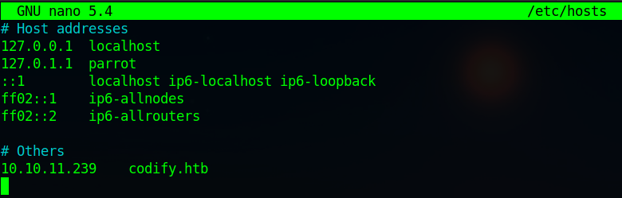
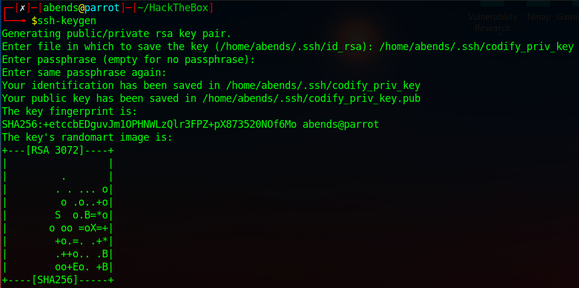

# HackTheBox: Codify

---

Проводим сканирование портов при помощи Nmap:


Найденный службы:
- 22 port - OpenSSH 8.9p1
- 80 port - Apache httpd 2.4.52
- 3000 port - Node.js Express framework

Далее в файл `/etc/hosts` добавляем IP и доменное имя жертвы:



Переходим на сайт:


Самое интересное, что данный ресурс предназнаен для исполнения кода (node.js). Это позволяет нам реализовать RCE


Сделаем `reverse shell`. Сначала включаем `nc` для прослушивания порта 4242:


Пытаемся через `bash` создать соединение, но получаем error:


Снова проверяем работоспособность, а также определяем наличие `python`:


Тут был немного ступор, поэтому пришлось смотреть решения других. И одно из них мне крайне понравилось.

Создаем одну пару ключей SSH:



Далее загружаем публичный ключ на хост:

```sh
mkdir /home/svc/.ssh/ && cd .ssh && echo "ssh-rsa AAAAB3NzaC1yc2EAAAADAQABAAAB<LONG_LONG_KEY>= abends@parrot" > authorized_keys
```


Проверяем наличие:


Теперь просто подключаемся по SSH:


Находим `tickets.db`, в котором находится хэш пароля пользователя `joshua`


Брутим пароль:


Переключаемся на `joshua`


Посмотрим возможности относительно sudo:


Нам доступен к запуску файл `/opt/scripts/mysql-backup.sh`


Окей, но вернемся назад и вспомним, что мы как минимум не забрали `user.txt`:


Помимо этого здесь же лежать такие файлы как `brute.py`, `script.py` и `wordlist.txt`


Немного изменим скрипт:


Запускаем скрипт и видим, как посимвольно появляется пароль:


Переключаемся на `root` и забираем флаг:


---
