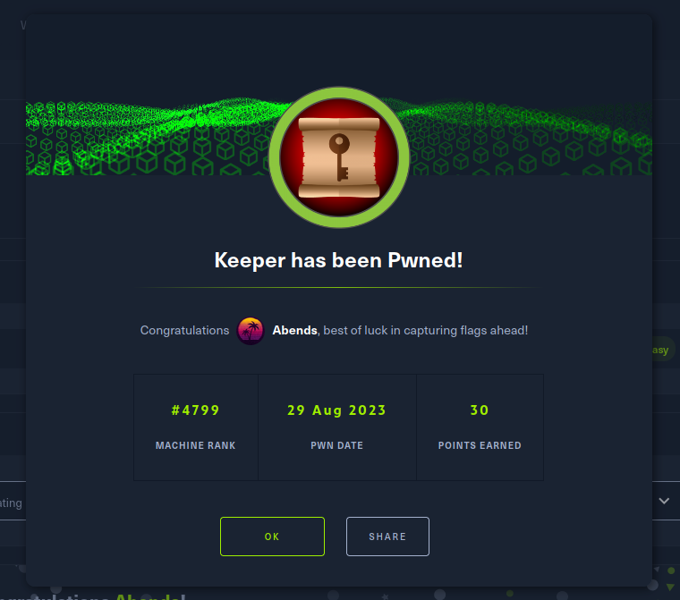

# HackTheBox: Keeper

---

Используем nmap для сканирования машины:
```sh
nmap -sC -sV 10.10.11.227
```


Находим сайт и SSH. Смотрим, что находится на сайте:


Для дальнейшего продвижения редактируем файл **/etc/hosts**:


Переходим по указанной ссылке и попадаем на форму логина:


Для системы **Best Practical** стандартные логин и пароль - **root:password**


В разделе с пользователями находим пользователя **lnorgaard**:


Также внутри у пользователя находим и пароль - **Welcome2023!**:


Пробуем подключиться по SSH с найденными учетными данными:


Забираем первый флаг:


Также в домашней директории пользователя замечаем и другие необычные файлы:
- KeePassDumpFull.dmp;
- RT30000.zip;
- passcodes.kdbx;
- poc.py (CVE-2023-32784)

**CVE-2023-32784**: В KeePass 2.x до 2.54 можно восстановить главный пароль в виде открытого текста из дампа памяти, даже если рабочее пространство заблокировано или больше не работает. Дамп памяти может представлять собой дамп процесса KeePass, файл подкачки (pagefile.sys), файл гибернации (hiberfil.sys) или дамп оперативной памяти всей системы. Первый символ восстановить невозможно. В версии 2.54 для смягчения последствий используется другое использование API и/или вставка случайных строк.

Т.е. мы уже по факту имеем дамп памяти (.dmp) и эксплойт:


Распознанный текст: **\*\*dgr\*d med fl\*de**

Как следует из описания CVE, первый символ не может быть восстановлен. Другие символы в таком случае могут являться специальными, поэтому они некорректно отображаются. Также на это намекает реальное имя пользователя - **Lise Nørgaard**. Символ **ø** можно встретить, например, в датском языке, а если немного погуглить, то можно выяснить, что в Дании есть десерт - **rødgrød med fløde**.

Устанавливаем сам **keepass2**:


Переносим файл, в котором хранятся пароли:


Вводим мастер-пароль:


И мы успешно попадаем внутрь файла:


> Учтите, что скопировать и вставить пароль нельзя, допускается только ввод, поэтому я в моем случае просто добавил датскую раскладку, где присутствует символ **ø**

Далее находим содержимое PuTTY-User-Key-File (SSH):


Копируем содержимое в файл с расширением **.ppk**:


Используя утилиту **puttygen**, можно конвертировать ключ в формат **.pem** (OpenSSH). Единственный момент - я не смог это сделать через терминал Linux из-за конфликта версии формата ключа, поэтому дальше я использовал Windows - так проще:

Открываем утилиту **PuTTYgen Key Generator** и меняем параметр **PPK file version** на значение **2**:


Затем экспортируем в новом формате:


Дальше подключаемся по SHH с полученным ключом и забираем второй флаг:




