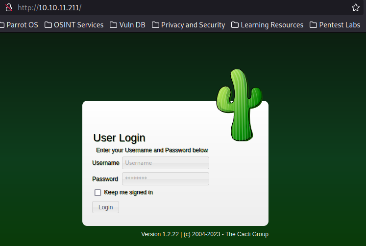
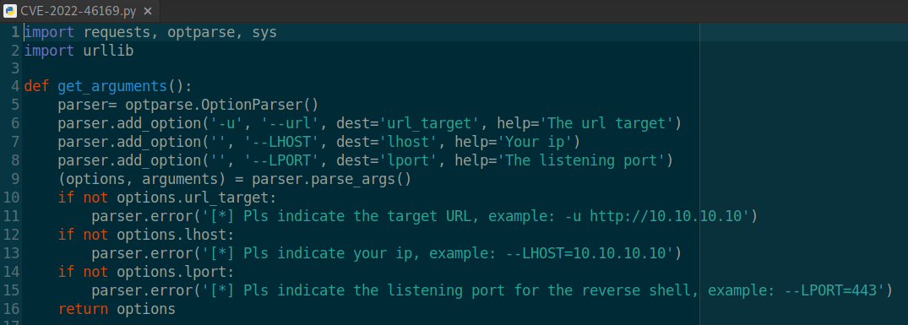
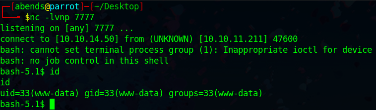
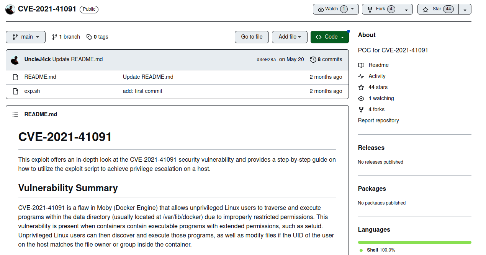
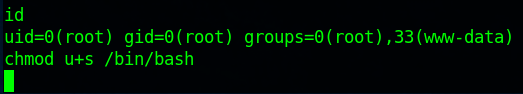

# HackTheBox: MonitorsTwo

---

Проводим сканирование портов при помощи Nmap:


Найденный службы:
- 22 port - OpenSSH 8.2p1
- 80 port - nginx 1.18.0

Переходим на сайт:



Перед нами система `Cacti версии 1.2.22`. На всякий случай для начала попробуем найти какие-либо директории:


Директорий достаточно, но мы так и не вошли. Поэтому посмотрим в сторону эксплойтов:


И да, есть `CVE-2022-46169` для `Cacti версии 1.2.22`

Находим эксплойт и сразу смотрим параметры:




Видим, что скрипт принимает параметры `LHOST` и `LPORT` - здесь надо указать IP и Port, где мы будем ожидать подключения. Открываем порт на прослушивание и запускаем эксплойт:


И вот мы получаем шелл:



Осматриваемся и понимаем, что мы внутри `docker-контейнера`


По-хорошему, нам бы воспользоваться `linPEAS`, поэтому для начала проверим наличие `curl`:


Отлично, `curl` установлен, поэтому скачиваем себе `linPEAS`


Инструмент у нас на месте, теперь перед нами стоит задача переброса его в контейнер. Дляэтого воспользуемся HTTP-сервером на основе `python`


Скачивание:


Активация:


Инструмент нашел некоторые пробелы в SUID. Интересно, что нам доступен `capsh`. Смотрим, как нам повысить привилегии относительно данной команды на `GTFORBins`:


Применяем команду:


Еще из интересного - `linPEAS` обнаружил переменные PHP, содержащие в себе логин и пароль в открытом виде для БД:


Из БД обнаруживаем MySQL:


Изучение процесса конфигурирования `Cacti` по мануалу:


Просматриваем таблицы:


Находим хэши пользователей:


Сохраняем в файл для дальнейшего брута:


Находим пароль:


Подключаемся уже напрямую к хосту:


Первый флаг:


Проверяем `sudo` права пользователя `marcus`:


Вот это да, мы без sudo, тогдп просматриваем SUID-файлы:


И тут тоже особо ничего интересного нет. Продолжаем искать и находим кое-что очень интересное:


Письмо с указанием на конкретные CVE. Последняя из трех уязвимостей:

```sh
CVE-2021-41091 - это ошибка в Moby (движке Docker), которая позволяет непривилегированным пользователям Linux просматривать и выполнять программы в каталоге данных (обычно расположенном по адресу /var/lib/docker) из-за неправильно ограниченных разрешений. Эта уязвимость присутствует, когда контейнеры содержат исполняемые программы с расширенными разрешениями, такими как setuid. Непривилегированные пользователи Linux могут затем обнаруживать и запускать эти программы, а также изменять файлы, если UID пользователя на хосте совпадает с владельцем файла или группой внутри контейнера.
```



Делаем себе права на `/bin/bash`



Воспользуемся командой `findmnt`. Эта команда позволяет задействовать одноименную утилиту, предназначенную для поиска точек монтирования файловых систем. Тут мы и находим контейнеры:


Активируем bash относительно одного из контейнеров (где ранее мы выдавали себе права на bash):


И вот мы можем получить второй флаг:


